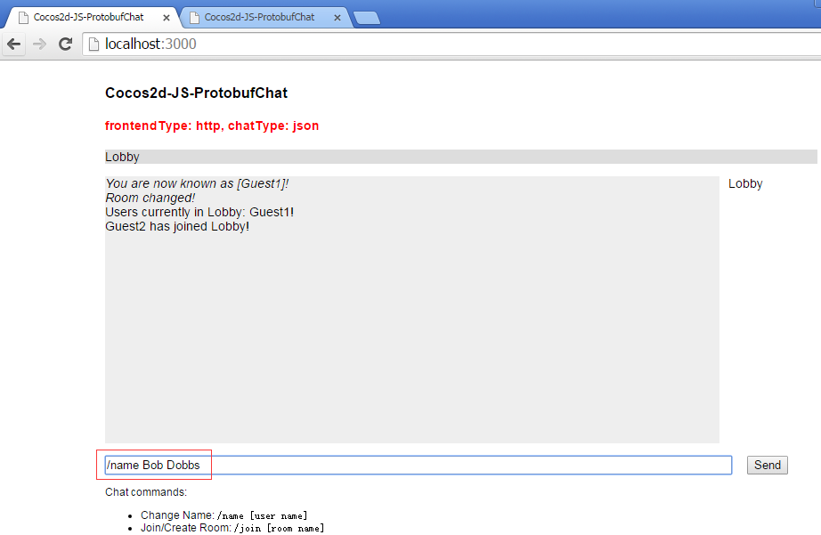
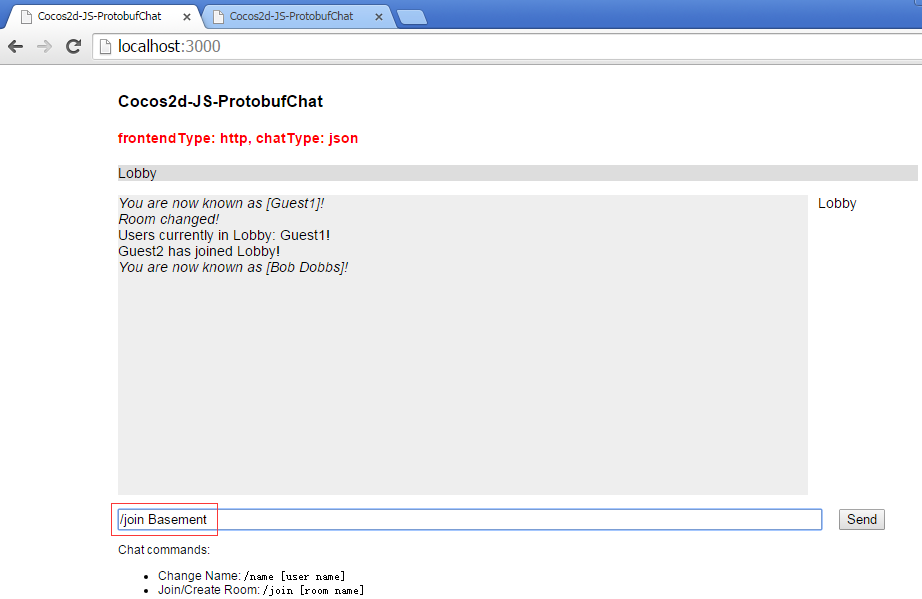

# Cocos2d-JS-ProtobufChat
后端使用NodeJS监听同一个端口对外提供Http以及SocketIO协议的通信服务，根据chatConfig.json配置的不同，NodeJS与前端的序列化协议可使用protobuf或者json

而前端客户端也根据chatConfig.json配置的不同，提供了cocos2d-js或者http（其实叫html更好）的客户端；具体描述以及截图请看下面（力不从心使用了蹩脚的英文描述，应该差不多都能看得懂吧，有语法错误也劳驾指正）

本例是基于SocketIO协议**长连接**的，而基于Http协议**短连接**的**更纯粹**使用Cocos2d-JS/Ajax+protobuf+NodeJS/Java Spring MVC的例子请看[Cocos2d-JS-Protobuf](https://github.com/whg333/Cocos2d-JS-Protobuf)和[cocos2d-js-ajax-protobuf-nodejs-springmvc](https://github.com/whg333/cocos2d-js-ajax-protobuf-nodejs-springmvc)

frontend(Cocos2d-JS/Html/RequireJS) communicate with backend(NodeJS/Java) by Http/SocketIO/Protobuf/Json protocol to implements Chat

## Instructions
1. Set up dependencies: `npm install`
2. Copy the cocos2d-js `frameworks` to frontend/cocos2d-js directory
3. Change Directory to backend/nodejs `cd backend/nodejs`
4. Run: `node server.js`
5. Open `http://localhost:3000` in a recent browser

## Config
you can modify **chatConfig.json** to choose **What You Want To Run** in  below:

| frontend type (client) | chat type (serialization protocol) |
| ---------------------- | ---------------------------------- |
| http | json |
| http | protobuf |
| coco2d-js | json |
| coco2d-js | protobuf |

## Snapshot
frontend is **cocos2d-js** And chat serialization protocol is **protobuf**


you can use **/name [user name]** command to changed your name


you can use **/join [room name]** command to create/join another room


frontend is **http(actually html is a better name)** And chat serialization protocol is **json**







## Update
**2016.4.27** use [netty-socketio](https://github.com/mrniko/netty-socketio) to Make Java backend

## Start Java backend server
1. `cd backend/java`
2. `mvn clean compile`
3. `mvn exec:java -Dexec.mainClass="com.why.game.chat.proto.ChatProtoServer"`
4. if you want client to connect Java backend server you have to change the socketio.connect in chatUI.js as below:

```java
	//var socket = socketio.connect('localhost:3000'); //nodejs
    var socket = socketio.connect('localhost:3001'); //java
```

## TODO
use NodeJS(child_process module & maven command) to start Java backend server.