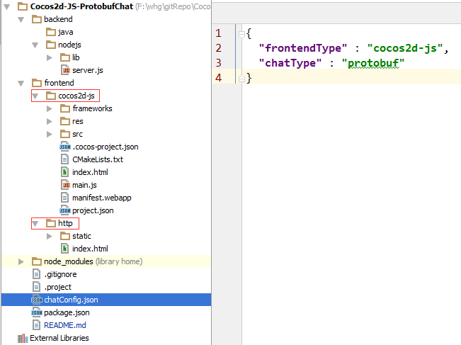
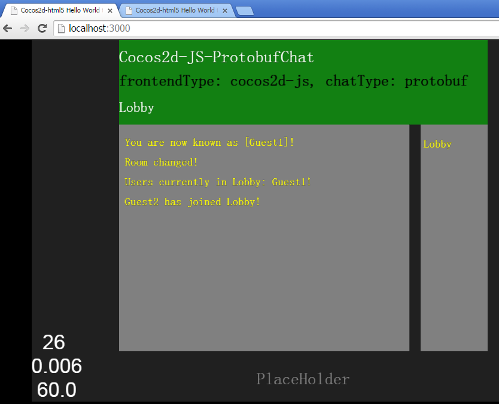
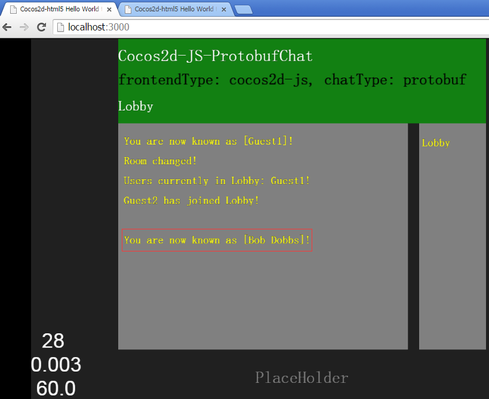
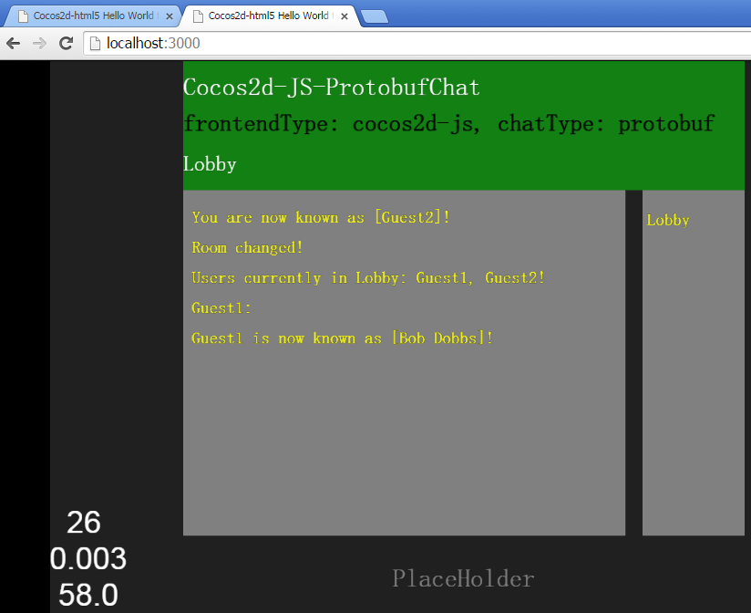
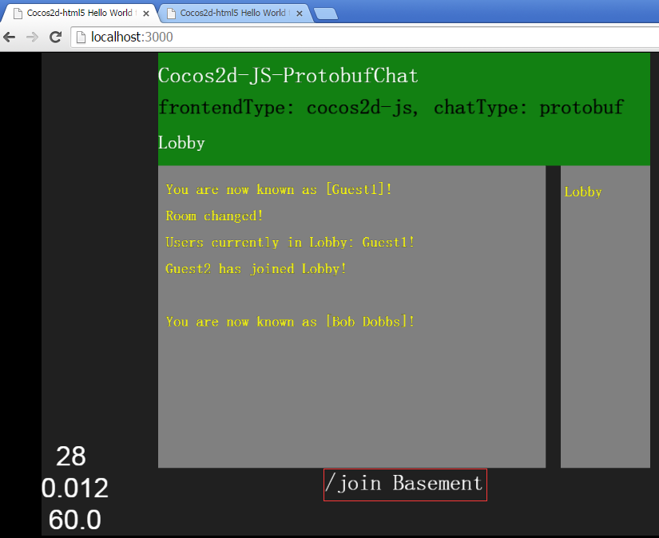
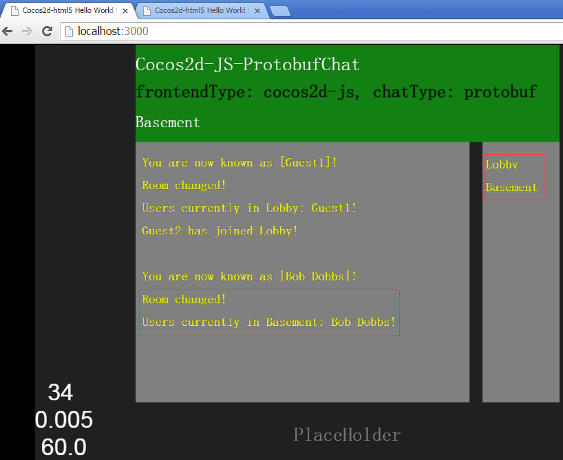
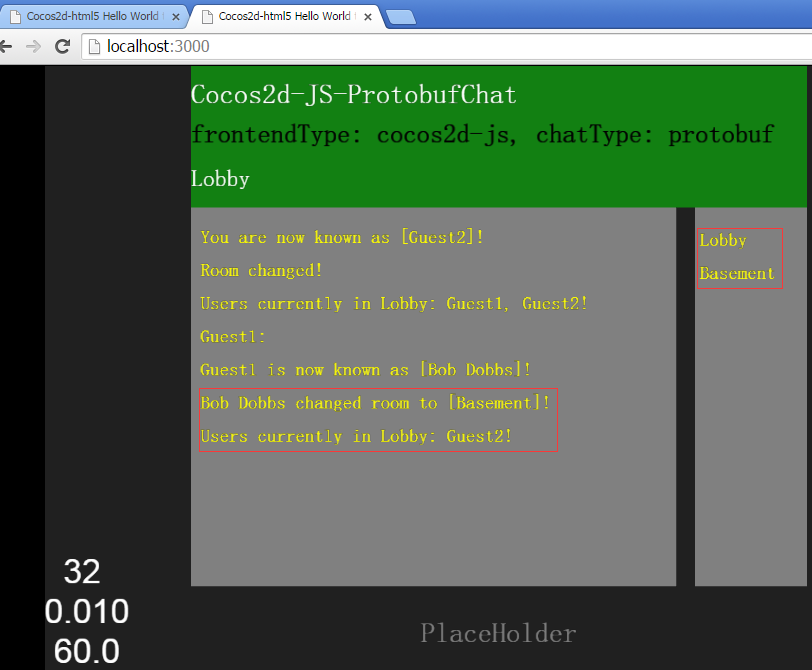
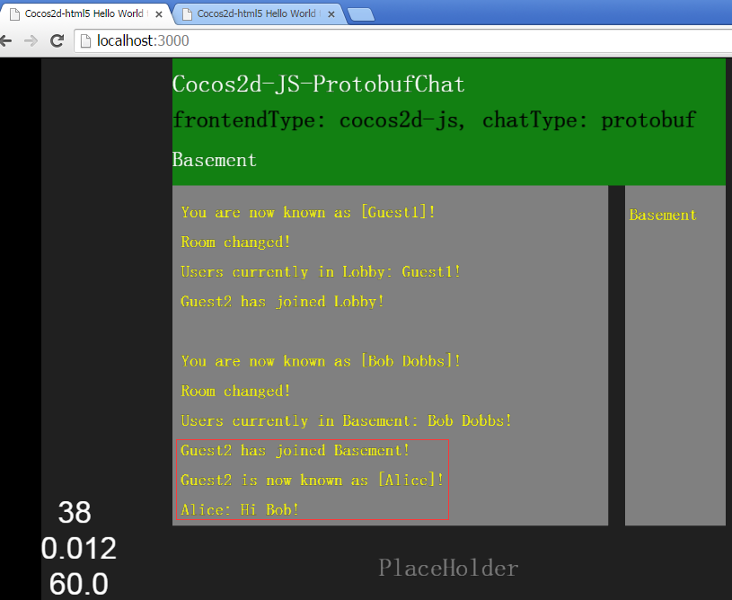
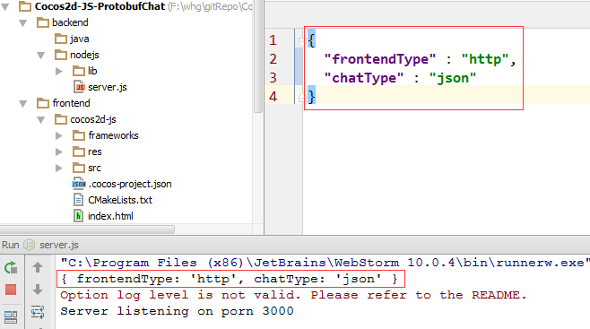
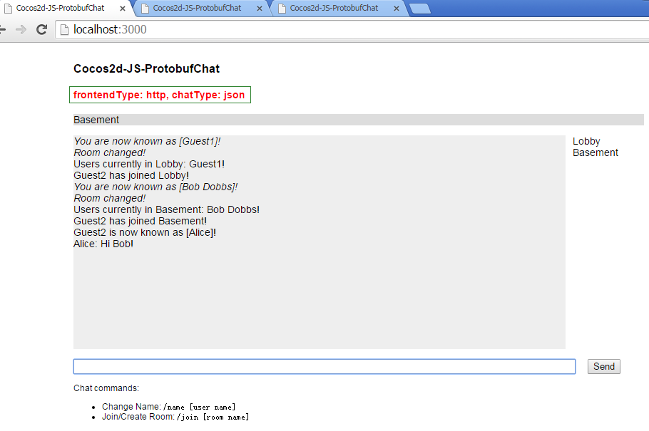

# Cocos2d-JS-ProtobufChat
frontend(Cocos2d-JS/Html) communicate with backend(NodeJS/Java) by SocketIO/Protobuf/Json protocol to implements Chat

## Example
Run **node server.js**

## Config
you can modify **chatConfig.json** to choose **What You Want To Run** in  below:

| frontend type   | chat type       |
| --------------- | --------------- |
| http | json |
| http | protobuf |
| coco2d-js | json |
| coco2d-js | protobuf |

## Snapshot
### frontend is cocos2d-js And chat protocol type is protobuf

### frontend is http And chat protocol type is json

