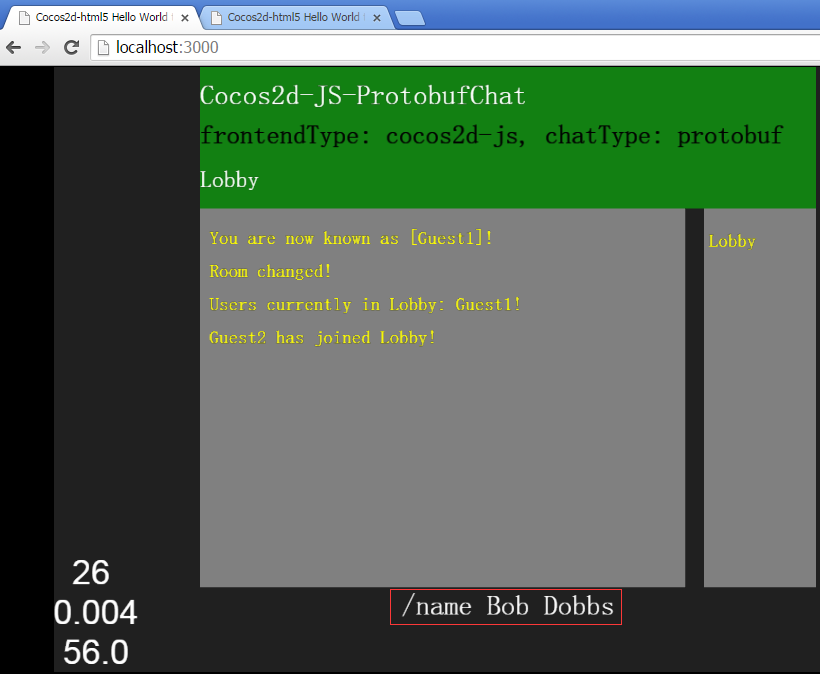

# Cocos2d-JS-ProtobufChat
后端使用NodeJS监听同一个端口对外提供Http以及SocketIO协议的通信服务，根据chatConfig.json配置的不同，NodeJS与前端的序列化协议可使用protobuf或者json；

而前端客户端也根据chatConfig.json配置的不同，提供了cocos2d-js或者http（其实叫html更好）的客户端；具体描述以及截图请看下面（力不从心使用了蹩脚的英文描述，差不多都能看得懂）

frontend(Cocos2d-JS/Html) communicate with backend(NodeJS/Java) by Http/SocketIO/Protobuf/Json protocol to implements Chat

## Example
Run **node server.js**

**Note:** if you want to run **cocos2d-js** frontend, please ensure copy cocos2d-js **frameworks** into the cocos2d-js directory

## Config
you can modify **chatConfig.json** to choose **What You Want To Run** in  below:

| frontend type (client) | chat type (serialization protocol) |
| ---------------------- | ---------------------------------- |
| http | json |
| http | protobuf |
| coco2d-js | json |
| coco2d-js | protobuf |

## Snapshot
frontend is **cocos2d-js** And chat serialization protocol is **protobuf**

you can use **/name [user name]** command to changed your name

you can use **/join [room name]** command to create/join another room

frontend is **http(actually html is a better name)** And chat serialization protocol is **json**

